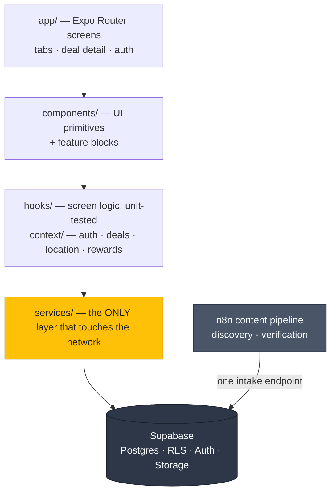
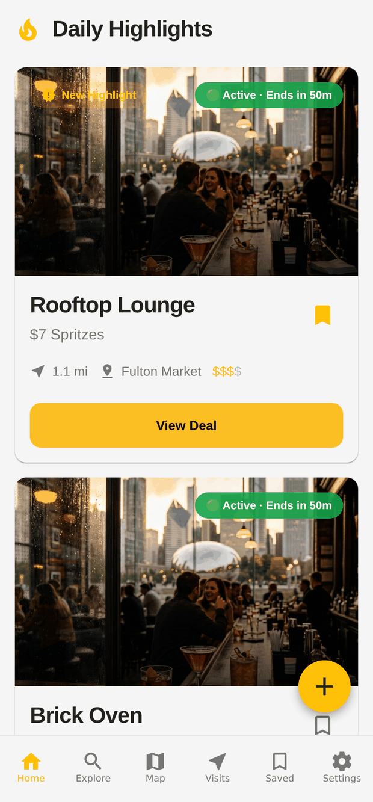
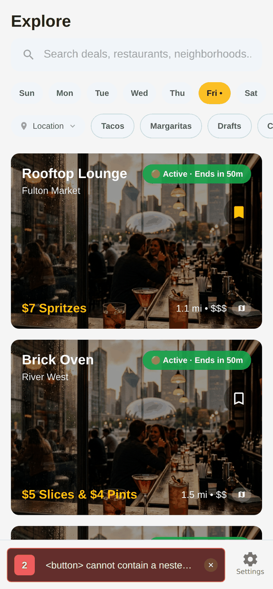
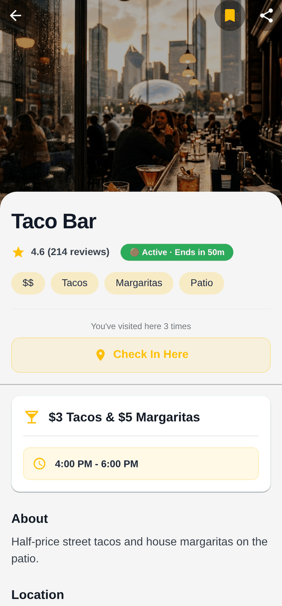
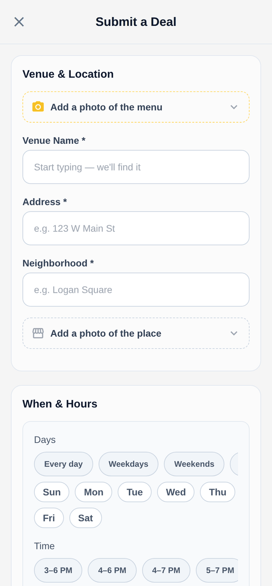
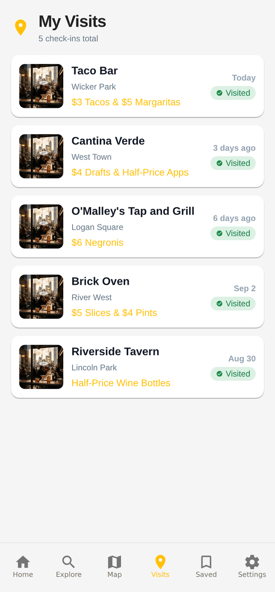
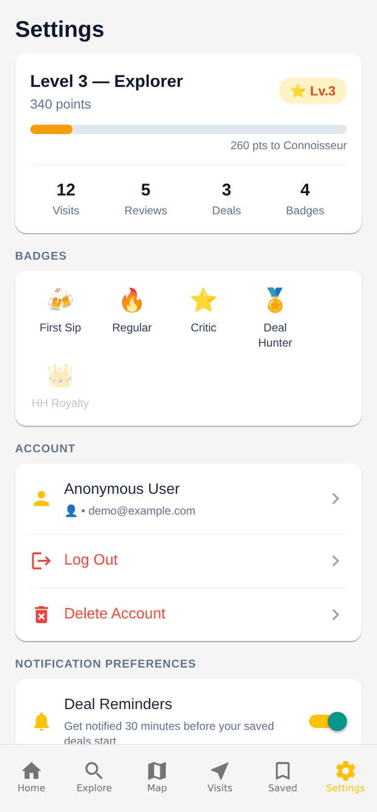

# Happy Hour Finder

A cross-platform Chicago-area happy hour discovery app built with Expo, React Native, TypeScript, and Supabase.

**Portfolio project:** I designed and built the product, mobile/web client, PostgreSQL backend, automated data pipeline, security model, and test suite. The system discovers restaurant deals, validates them, and routes uncertain results to human review instead of silently publishing bad data.

One TypeScript codebase ships to iOS, Android, and the web.

**[Architecture](./docs/Architecture.md) · [Content Pipeline](./n8n-workflows/README.md) · [Device Testing](./docs/Device-Testing.md) · [Privacy Policy](./docs/Privacy-Policy.md)**

[](https://github.com/sir1602/Happy-Hour-Finder-portfolio/actions/workflows/ci.yml)


[](./LICENSE)

**967 tests across 49 suites · 20 SQL migrations · 14 RLS policies · 213 accessibility props ·
iOS + Android + web from one codebase**

---

## ✨ Features

- **Clustered map view** — bars and restaurants with live happy hours on a native map, clustered
  with `supercluster` so a dense downtown stays readable at every zoom level.
- **Explore with real filtering** — search and filter by neighbourhood, deal type, price band, and
  time of day. Full-text search runs server-side against a Postgres `tsvector` column, not in the
  client.
- **Daily highlights** — a home feed of trending, newly added, and ending-soon deals.
- **Accounts** — email/password, magic link, Google and Apple sign-in, password recovery, and
  account deletion, with "continue as guest" available throughout.
- **Submit a deal from a photo** — photograph a menu board and the deal is read off the image
  (OCR + LLM extraction) and pre-fills the submission form for the user to correct. The extraction
  never writes to the database directly.
- **Check-ins, points, and badges** — check in at a venue, earn points, unlock badges, and review
  your visit history. Point values are server-authoritative.
- **Deal confidence badges** — deals the re-validation pipeline can no longer confirm against their
  source are badged *Unconfirmed* rather than presented as fact.
- **Report and feedback** — report an incorrect deal from its detail screen, or send general
  feedback from Settings, signed in or as a guest.
- **Built for screen readers** — 213 accessibility props (`accessibilityLabel`, `Role`, `State`,
  `Hint`) across 27 of 46 component files, so the app is navigable with VoiceOver and TalkBack
  rather than being a grid of unlabelled touch targets.
- **Degrades instead of breaking** — cached reads (`services/cacheService.ts`), a network banner,
  skeleton loaders, an error boundary, and a configuration-error screen that names the missing
  variable instead of showing a white screen.
- **Light and dark themes** — an amber-and-charcoal palette across both.

---

## 🛠️ Tech Stack

| Layer | Choice |
|---|---|
| Framework | [Expo](https://expo.dev/) (SDK 57) with [Expo Router](https://docs.expo.dev/router/introduction/) for file-based navigation |
| UI | [React Native](https://reactnative.dev/) 0.86 / React 19 |
| Language | [TypeScript](https://www.typescriptlang.org/) |
| Styling | [NativeWind](https://www.nativewind.dev/) (Tailwind CSS for React Native) |
| Maps | [react-native-maps](https://github.com/react-native-maps/react-native-maps) + [supercluster](https://github.com/mapbox/supercluster) |
| Backend | [Supabase](https://supabase.com/) — Postgres, Row Level Security, Auth, Storage |
| Server state | [TanStack Query](https://tanstack.com/query) |
| Automation | [n8n](https://n8n.io/) workflows for content discovery and verification |
| Observability | [Sentry](https://sentry.io/) (crashes) and [PostHog](https://posthog.com/) (product analytics) |
| Testing | [Jest](https://jestjs.io/) + [@testing-library/react-native](https://callstack.github.io/react-native-testing-library/) |

---

## 🏗️ Architecture Overview

The app is a universal Expo app. Screens never talk to Supabase directly — every read and write
goes through a module in `services/`, which is what makes the data layer mockable in tests and
swappable in principle.



Three decisions carry most of the weight:

**Authorization lives in the database, not the client.** Every table is RLS-enabled. Privileged
operations — incrementing reward points, deleting an account, attributing a submission — are
narrowly-scoped `SECURITY DEFINER` functions rather than broad table grants, so a client cannot
write a value it should not be able to compute. The rewards RPC takes an *action name* and looks the
point value up itself; it does not accept a client-supplied total.

**Screen logic is extracted into hooks.** `useExploreScreen`, `useMapClusters`, `useDealDetail`,
`useSubmitDealForm` and friends hold the behaviour, so it can be tested without rendering a native
map or a camera roll.

**The content pipeline cannot silently corrupt the catalogue.** Automated writes pass through one
intake endpoint with a confidence threshold and a time-window parse gate; nothing is ever
hard-deleted, a low-confidence reading never overwrites a high-confidence one, and anything
uncertain queues for human review. See
[`n8n-workflows/README.md`](./n8n-workflows/README.md) for the full design.

Deeper detail: [`docs/Architecture.md`](./docs/Architecture.md).

---

## 🔧 Engineering Highlights

The parts most worth reading, if you're only going to read a few:

- **Authorization is a database concern.** 20 SQL migrations, 14 RLS policies and 11 narrowly
  scoped `SECURITY DEFINER` functions under [`scripts/`](./scripts). The rewards RPC takes an
  *action name* and looks the point value up server-side — it will not accept a client-supplied
  total.
- **The content pipeline can't silently corrupt the catalogue.** A deal publishes only if
  extraction confidence ≥ 0.80 *and* its time window parses under the same `parseDealTime()` the
  app renders with. Everything else queues for human review, and nothing is ever hard-deleted.
- **Sibling-collision guard.** A venue with different hours per day is a group of sibling rows, not
  one row with a clever string. `hh_record_verification()` refuses a reading that would make two
  siblings overlap — without it, the nightly sweep rewrites one schedule into a copy of another and
  a deal silently disappears from the app.
- **CSRF closed by `Origin`, not `Sec-Fetch-Site`.** The review console sits behind basic auth, and
  basic auth rides a cross-site request exactly like a cookie does. The first implementation trusted
  `Sec-Fetch-Site` and refused every real approval for a day — the story and the fix are in
  [`__tests__/n8n/reviewApplyRequest.test.js`](./__tests__/n8n/reviewApplyRequest.test.js).
- **Screen logic lives in hooks.** `useExploreScreen`, `useMapClusters`, `useDealDetail`,
  `useSubmitDealForm` hold the behaviour, so it's unit-tested without rendering a native map or a
  camera roll — which is most of why 967 tests are practical at all.
- **Measured, not asserted.** `npm run bench` runs three micro-benchmarks with zero dependencies;
  `Set.has` beats `Array.includes` by **~10×** on the filter path. See
  [`benchmarks/`](./benchmarks).

---

## 📸 Screenshots

> Captured from the web build. The venues, deals and photos are **demo data** — the UI,
> layout, states and interactions are the real thing.

| Home — daily highlights | Explore — filter by day, tag, neighbourhood | Deal detail |
|---|---|---|
|  |  |  |

| Submit a deal — read from a photo | Visit history | Rewards & badges |
|---|---|---|
|  |  |  |

The map screen is native-only — `components/MapImpl.web.tsx` is a deliberate fallback, so
the clustered map isn't represented above.

---

## 🚀 Installation

Requires **Node.js 20.19.4 or newer** (React Native 0.85+ dropped everything below that; CI runs
Node 22).

> **This app cannot run in Expo Go.** It depends on custom native modules — `react-native-maps`,
> `@sentry/react-native`, `expo-apple-authentication`, `expo-notifications`, `expo-image-picker`,
> `expo-location` — and on config plugins that modify the native projects. Expo Go ships a fixed
> module set and cannot load any of them. You need a **development build**: your own binary with
> these modules compiled in, plus the usual fast JS reload.

```bash
git clone https://github.com/sir1602/Happy-Hour-Finder-portfolio.git
cd Happy-Hour-Finder-portfolio
npm install
cp .env.example .env     # then fill it in — see Configuration below
```

Build and run:

```bash
npx expo prebuild        # generates ios/ and android/ from app.json
npx expo run:android     # device or emulator
npx expo run:ios         # simulator (macOS + Xcode required)
```

After the first native build, `npx expo start --dev-client` is enough for JS-only changes. Rebuild
only when native dependencies or `app.json` change.

Building in the cloud with [EAS](https://docs.expo.dev/build/introduction/) instead:

```bash
eas init                                                      # claim your own project id
eas build --profile development --platform android
eas build --profile development-simulator --platform ios      # skips Apple device provisioning
```

---

## ⚙️ Configuration

Copy `.env.example` to `.env` and fill it in. That file documents every variable and what happens
when each is missing; the short version:

| Variable | Required? | Missing behaviour |
| --- | --- | --- |
| `EXPO_PUBLIC_SUPABASE_URL` | **Yes** | App opens to a configuration-error screen |
| `EXPO_PUBLIC_SUPABASE_ANON_KEY` | **Yes** | App opens to a configuration-error screen |
| `EXPO_PUBLIC_GOOGLE_MAPS_API_KEY` | In practice | Map renders blank |
| `EXPO_PUBLIC_SENTRY_DSN` | No | Crash reporting off |
| `EXPO_PUBLIC_SENTRY_ENVIRONMENT` | No | Falls back to `NODE_ENV` |
| `EXPO_PUBLIC_SENTRY_TRACES_SAMPLE_RATE` | No | Defaults to `0` (off) |
| `EXPO_PUBLIC_POSTHOG_API_KEY` | No | Analytics off |
| `EXPO_PUBLIC_POSTHOG_HOST` | No | Defaults to PostHog cloud |
| `EXPO_PUBLIC_PRIVACY_POLICY_URL` | No | Falls back to the document in this repo |
| `EXPO_PUBLIC_TERMS_URL` | No | Empty — the Settings row is hidden |
| `EXPO_PUBLIC_WEB_BASE_URL` | No | Deal sharing disabled |
| `EXPO_PUBLIC_HH_SCAN_URL` | No | Photo-scan button hidden; manual submission unaffected |

**Every `EXPO_PUBLIC_*` value is inlined into the JS bundle at build time and ships inside the
binary, so none of them is a secret.** The Supabase key here is the public anon key, whose real
boundary is Row Level Security; the Maps key must be restricted by API and by app in the Google
Cloud Console. Never put a service-role key or any server-side credential in this file.

A local `.env` covers local builds only — EAS Build never sees it, because `.env` is gitignored and
so is absent from the uploaded archive. Set those separately with `eas env:create`.

Backend setup (tables, RPCs, storage buckets) is documented in
[`docs/Backend-Setup.md`](./docs/Backend-Setup.md), with the SQL itself under `scripts/`.

---

## 💻 Usage

```bash
npm start            # Expo dev server
npm run android      # build and run on Android
npm run ios          # build and run on iOS
npm run web          # run in the browser

npm run typecheck    # tsc --noEmit
npm run lint         # eslint
npm test             # jest
npm run bench        # micro-benchmarks, no deps (Node 22 type stripping)
```

`typecheck`, `lint`, and `test` are exactly what CI runs on every pull request
(`.github/workflows/ci.yml`). None of them builds the app natively — see
[`docs/Device-Testing.md`](./docs/Device-Testing.md) for what only a real build can catch.

---

## 📁 Folder Structure

```
.
├── app/                 # Expo Router screens — file-based routing
│   ├── (tabs)/          #   Home, Explore, Map, Saved, Visits, Settings
│   ├── auth/            #   OAuth callback, password reset
│   ├── deal/[id].tsx    #   Deal detail: info, reviews, check-in
│   ├── login.tsx
│   ├── onboarding.tsx
│   └── submit-deal.tsx
├── components/          # UI components
│   ├── ui/              #   primitives: Button, Badge, Chip, Skeleton, states
│   ├── map/             #   cluster markers, tile fallbacks
│   └── submit/          #   submission form blocks
├── hooks/               # screen logic, extracted for testability
├── context/             # auth, deals, location, rewards, visits providers
├── services/            # the only layer that talks to Supabase or the network
├── utils/               # pure helpers: time parsing, geo, validation, pricing
├── constants/           # colours, links, legal URLs, form presets
├── types/               # database types generated from the live schema
├── scripts/             # SQL migrations + asset generation
├── n8n-workflows/       # content automation pipeline design docs
├── benchmarks/          # runnable micro-benchmarks (`npm run bench`)
├── __tests__/           # Jest suites, mirroring the source tree
└── docs/                # architecture, backend setup, testing, roadmap
    └── screenshots/     # README imagery
```

---

## 🔭 Future Improvements

- **Multi-city expansion.** The metro resolution layer exists and the burst-scan workflow can target
  any area; what's missing is the UI for choosing one.
- **Adopt TanStack Query for data fetching.** `QueryClientProvider` is wired up but the services
  layer still fetches directly — moving it would bring caching and revalidation for free.
- **Personalised recommendations** based on check-in history and saved venues.
- **Social layer** — friends, shared lists, and a leaderboard. The points/badges infrastructure is
  already in place; check-ins are currently private by design.
- **Reviews moderation** — reviews need report/block affordances before any public store release.
- **Venue-owner dashboard** for claiming a listing and correcting hours at the source.
- **Push notifications for saved venues** when a deal is starting soon.

The longer-range plan is in [`docs/Roadmap.md`](./docs/Roadmap.md).

---

## 📚 Documentation

- [Architecture](./docs/Architecture.md) — technical breakdown and design patterns
- [Backend Setup](./docs/Backend-Setup.md) — Supabase RPCs, columns, and storage buckets
- [Device Testing](./docs/Device-Testing.md) — building a dev client and verifying what CI cannot
- [Content Pipeline](./n8n-workflows/README.md) — how deals are discovered and verified
- [Roadmap](./docs/Roadmap.md) — planned features
- [Privacy Policy](./docs/Privacy-Policy.md) — alpha draft; legal review required before production release

---

## 📄 License

Released under the [MIT License](./LICENSE).

---

## 📬 Contact

Built by **Simon** — [@sir1602](https://github.com/sir1602).

Questions and issues are welcome via
[GitHub Issues](https://github.com/sir1602/Happy-Hour-Finder-portfolio/issues).
